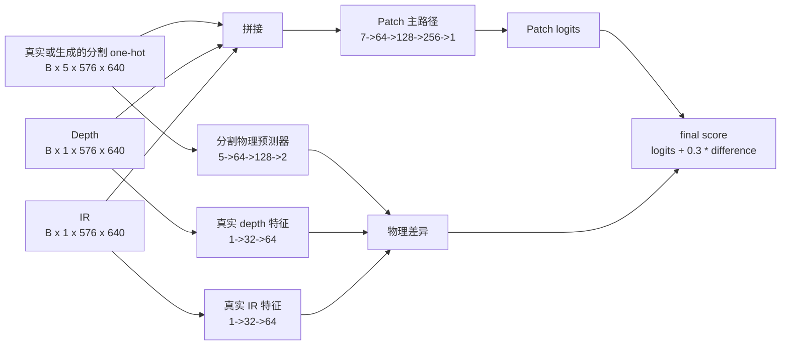

# 判别器网络架构

本文档描述当前 GAN 消融实验 6--9 使用的基础判别器 `TOFPhysicsDiscriminator`（定义于 `models/discriminator.py`）。当前配置通过 `create_discriminator()` 选择基础单尺度版本，而不是多尺度或包装式 PatchGAN 版本。

## 1. 输入、输出与当前配置

| 项目 | 当前值 |
|---|---|
| 分割输入 | `B x 5 x H x W`，真实/生成的 5 类 one-hot 分割图 |
| TOF 条件 | 开启，额外输入 depth、IR，各 `B x 1 x H x W` |
| 主路径输入 | `B x 7 x H x W` = 5 分割通道 + 2 TOF 通道 |
| 基础通道数 | 64 |
| 下采样卷积层数 | 3 |
| 归一化 | GroupNorm，最多 16 组；第一层无归一化 |
| 物理分支下采样 | 4 倍 |
| 输出 | Patch 评分图 + 物理不一致评分图 |
| 参数量 | 约 `803,459` |

输入分辨率为 `576 x 640` 时，两个输出都是 `B x 1 x 71 x 79`。



## 2. Patch 主判别路径

`condition_on_tof=true` 时，D 的主路径直接观察“当前 TOF 观测下的分割图是否真实”。它不是只根据分割图的形状判真伪。

| 层 | 结构 | `576 x 640` 输入后的输出 |
|---|---|---|
| 输入 | 拼接 `[segmentation one-hot, depth, IR]` | `B x 7 x 576 x 640` |
| Conv 1 | `4x4 Conv(7->64, stride=2, pad=1) + LeakyReLU(0.2)` | `B x 64 x 288 x 320` |
| Conv 2 | `4x4 Conv(64->128, stride=2, pad=1) + GroupNorm(16) + LeakyReLU(0.2)` | `B x 128 x 144 x 160` |
| Conv 3 | `4x4 Conv(128->256, stride=2, pad=1) + GroupNorm(16) + LeakyReLU(0.2)` | `B x 256 x 72 x 80` |
| 输出 | `4x4 Conv(256->1, stride=1, pad=1)` | `B x 1 x 71 x 79` |

每个输出位置对应重叠局部区域的评分，因此它是 PatchGAN 风格的判别器，而非输出单个全图真假标量。

## 3. 物理一致性支路

该支路比较两类物理表征：

1. 从当前真实 depth、IR 提取的 2 通道表征；
2. 由分割图预测出的 2 通道表征。

为降低显存，depth、IR 与分割预测器都先处理到 `H/4 x W/4`。在 `576 x 640` 输入下，该尺度为 `144 x 160`。

| 分支 | 结构 | 中间输出 |
|---|---|---|
| 真实 depth | `3x3 Conv(1->32) + GN + LeakyReLU -> 3x3 Conv(32->64) + GN + LeakyReLU` | `B x 64 x 144 x 160` |
| 真实 IR | 与 depth 分支同构 | `B x 64 x 144 x 160` |
| 真实物理表征 | 两分支各沿通道平均，再拼接 | `B x 2 x 144 x 160` |
| 分割物理预测器 | 分割图缩至 `144 x 160`；`3x3 Conv(5->64) -> 3x3 Conv(64->128) -> 1x1 Conv(128->2)`，前两层均含 GN + LeakyReLU | `B x 2 x 144 x 160` |
| 一致性得分 | 两个 2 通道特征均插值到 `71 x 79`，逐元素绝对差后在通道维求均值 | `B x 1 x 71 x 79` |

最终评分为：

```text
final_discrimination = patch_logits + 0.3 * physics_consistency
```

因此 `final_discrimination` 是用于 LSGAN 损失的评分，不应解释为已经过 sigmoid 的真实概率。

> 注意：代码会构建 `physics_extractor['material_boundary']`（`5->32->64`），但当前 `TOFPhysicsDiscriminator.forward()` 没有调用该分支。当前真实物理表征只来自 depth 与 IR；该边界支路不参与前向、损失或参数更新。

## 4. D 与 G 的训练关系

### 判别器更新

- 真实样本：真实 mask 转为 5 通道 one-hot。
- 生成样本：G 的 logits 转为 straight-through hard one-hot。D 的前向看到 argmax one-hot，反向时梯度仍可经 softmax 回传给 G。
- 两类样本都可加入同强度的实例噪声到 segmentation、depth、IR 输入。
- 当前损失为 LSGAN，真实标签采用单侧平滑，生成标签为 0。
- 真实物理差异被压向 0，生成物理差异被压向 0.5。

### 生成器更新

从 epoch 50 起，G 接收：

```text
L_G = L_seg + lambda_gan * L_GAN + lambda_physics * L_physics
```

其中当前基础 `lambda_gan=0.02`，并在 50 个 epoch 内升温；`lambda_physics_consistency=0.1` 也随 GAN 升温比例启用。G 更新时 D 的参数被冻结，D 的梯度不会被更新。

## 5. 未启用或非当前主路径的判别器实现

代码还定义了 `MultiScaleDiscriminator` 与 `PatchGANDiscriminator` 包装器，但当前配置没有设置 `discriminator_type=multi_scale` 或 `patch`，所以实验 6--9 不使用它们。本文的层级和张量尺寸均针对实际使用的 `TOFPhysicsDiscriminator` 基础版本。

推理阶段不创建或调用判别器；D 仅服务于训练期的对抗与物理一致性约束。
