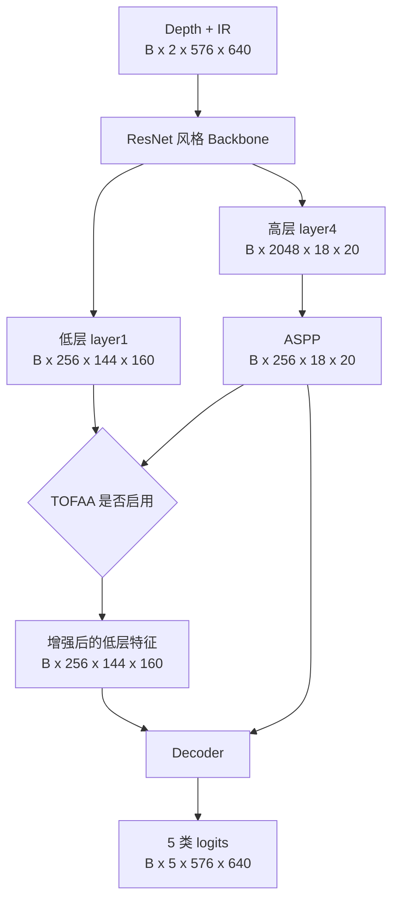

# 生成器网络架构

本文档描述当前消融实验 6--9 实际使用的生成器：`DeepLabV3Plus`（定义于 `models/deeplabv3plus.py`）。基础配置文件的默认 `generator_type` 仍是 `tof_physics`，但 `ablation_study.py` 会为实验 6--9 覆盖为 `deeplabv3plus`。

## 1. 输入、输出与配置

| 项目 | 当前值 |
|---|---|
| 输入 | `B x 2 x H x W`，通道顺序 `[depth, IR]` |
| 当前训练尺寸 | `H=576, W=640` |
| 输出 | `B x 5 x H x W` 未归一化分割 logits |
| 类别 | 背景、VMPET、PI、SCTP、BCC |
| 主干 | ResNet-50 风格 bottleneck，block 数 `3, 4, 6, 3` |
| 高层上下文 | ASPP，空洞率 `6, 12, 18` |
| 解码器 | DeepLabV3+ 低层/高层特征融合 decoder |
| 实验 6/7 | 不启用 TOFAA，参数量约 `40,344,933` |
| 实验 8 | `material_aware_v2`，参数量约 `42,215,564` |
| 实验 9 | `material_aware_v3`，参数量约 `42,344,236` |

模型输出是 logits；训练损失接收 logits，推理时用 `argmax(dim=1)` 得到类别图。



## 2. Backbone：ResNet 风格特征提取

输入 `B x 2 x 576 x 640` 时的实际尺度如下。

| 阶段 | 结构 | 输出 |
|---|---|---|
| 输入 | depth、IR 拼接 | `B x 2 x 576 x 640` |
| Stem | `7x7 Conv(2->64, stride=2) + BN + ReLU` | `B x 64 x 288 x 320` |
| Pool | `3x3 MaxPool(stride=2)` | `B x 64 x 144 x 160` |
| `layer1` | 3 个 bottleneck，首块 stride=1 | `B x 256 x 144 x 160` |
| `layer2` | 4 个 bottleneck，首块 stride=2 | `B x 512 x 72 x 80` |
| `layer3` | 6 个 bottleneck，首块 stride=2 | `B x 1024 x 36 x 40` |
| `layer4` | 3 个 bottleneck，首块 stride=2 | `B x 2048 x 18 x 20` |

每个 bottleneck 为：

```text
1x1 Conv(in -> mid) -> BN -> ReLU
-> 3x3 Conv(mid -> mid, stride=1/2) -> BN -> ReLU
-> 1x1 Conv(mid -> 4*mid) -> BN
-> 残差相加 -> ReLU
```

当通道数或空间尺度变化时，残差支路以 `1x1 Conv + BN` 投影对齐。`layer1` 的低层特征保留边界细节；`layer4` 的高层特征提供材料语义。

## 3. ASPP：高层多尺度上下文

ASPP 输入 `B x 2048 x 18 x 20`，包含五个并行的 256 通道分支：

| 分支 | 操作 |
|---|---|
| 1 | `1x1 Conv(2048->256) + BN + ReLU` |
| 2 | `3x3 Atrous Conv(2048->256, dilation=6) + BN + ReLU` |
| 3 | `3x3 Atrous Conv(2048->256, dilation=12) + BN + ReLU` |
| 4 | `3x3 Atrous Conv(2048->256, dilation=18) + BN + ReLU` |
| 5 | 全局平均池化 -> `1x1 Conv(2048->256) + BN + ReLU` -> 双线性上采样 |

五路输出拼接为 `B x 1280 x 18 x 20`，经：

```text
1x1 Conv(1280->256) -> BN -> ReLU -> Dropout2d(p=0.1)
```

得到 `B x 256 x 18 x 20`。这个 `Dropout2d(0.1)` 是 ASPP 固有层，不等于可选的 `DropBlock2D`。

## 4. Decoder：融合低层边界与高层语义

| 路径 | 操作 | 输出 |
|---|---|---|
| 低层路径 | `1x1 Conv(256->48) + BN + ReLU` | `B x 48 x 144 x 160` |
| 高层路径 | ASPP 输出上采样至 `144 x 160` | `B x 256 x 144 x 160` |
| 融合 | 拼接为 304 通道 -> `3x3 Conv(304->256) + BN + ReLU + Dropout2d(0.1)` | `B x 256 x 144 x 160` |
| 分类 | `3x3 Conv(256->256) + BN + ReLU -> 1x1 Conv(256->5)` | `B x 5 x 144 x 160` |
| 输出 | 双线性上采样 4 倍 | `B x 5 x 576 x 640` |

## 5. TOFAA 可选分支

TOFAA 始终作用于 `layer1` 的低层特征，不直接处理最终 logits。

### 5.1 V2：实验 8 的 `material_aware_v2`

输入：

```text
x       : B x 256 x 144 x 160
depth   : B x 1   x 144 x 160
IR      : B x 1   x 144 x 160
```

1. depth、IR 各经两层 `3x3 Conv + BN + ReLU`，得到各 16 通道特征。
2. 拼接为 32 通道物理特征；`1x1 Conv(32->16->1) + Sigmoid` 生成物理门。
3. 物理特征与 `x` 拼接为 288 通道，分别生成 ECA 通道注意力和空间注意力。
4. 经 `3x3 Conv(288->256->256)` 融合为 `attended`。
5. 残差门 `1x1 Conv(512->256->256) + Sigmoid` 控制写入量：

```text
y = x + attended * residual_gate(x, attended)
```

残差门最后一个卷积初始化为权重 0、偏置 -3，使训练初期为保守的小残差更新。

### 5.2 V3：实验 9 的 `material_aware_v3`

V3 在 V2 的 depth/IR 条件上增加 ASPP 语义条件：

```text
x        : B x 256 x 144 x 160
depth,IR : B x 1   x 144 x 160
semantic : B x 256 x 18 x 20  （ASPP 输出）
```

ASPP 语义先上采样到 `144 x 160`，再以 `1x1 Conv(256->32) + BN + ReLU` 压缩为 32 通道。它与 depth/IR 的 32 通道特征拼接为 64 通道条件，随后用于：

- `1x1 Conv(64->32->1) + Sigmoid` 的物理-语义门；
- `3x3 Conv(320->128) -> 7x7 Conv(128->1)` 的空间注意力；
- ECA 通道注意力和 `1x1 Conv(320->256)` 投影；
- `3x3 Conv(320->256->256)` 的融合分支；
- 与 V2 相同的 `512->256->256` 残差门。

因此 V3 的关键区别是：低层 TOF 信息不再单独决定注意力，而由高层材料语义共同调制。

## 6. 当前消融中的生成器差异

| 实验 | 生成器差异 |
|---|---|
| 6 | DeepLabV3+，不含 TOFAA、无传感器噪声 |
| 7 | 与 6 相同的生成器；仅训练数据增加传感器噪声 |
| 8 | 7 + TOFAA V2 |
| 9 | 7 + TOFAA V3 |

`fusion_type=none` 是当前 6--9 的实际设置：`TOFPhysicsModule`、`AttentionFusion` 的 early/mid/late 物理融合分支不会实例化。可选的 DropBlock 也未在 6--9 启用。

## 7. 训练与推理职责

- 生成器始终优化分割损失（Dice、Focal、Cross Entropy）。
- 从 `gan_start_epoch=50` 开始，生成器额外接收 GAN 与物理一致性辅助梯度。
- 推理时只使用生成器；判别器和 GAN 损失不参与推理。

